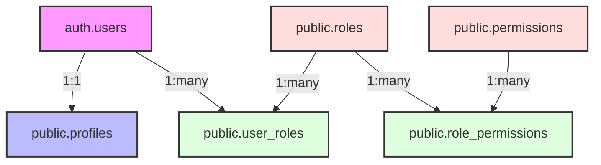

# Desert Skies Portal: Authentication and Role-Based Access Control (RBAC)

This document outlines the authentication and role-based access control (RBAC) system for the Desert Skies Aviation Training Portal.

## 1. System Overview

Our RBAC system is designed to be flexible, scalable, and secure, allowing for granular control over user permissions. The core idea is to separate *who a user is* (their roles) from *what a user can do* (their permissions).

### Data Model

The following diagram illustrates the relationship between the different database tables involved in our RBAC implementation:



-   **`auth.users`**: The standard Supabase authentication table.
-   **`public.profiles`**: Stores public user profile information.
-   **`public.roles`**: A list of all available roles (e.g., `admin`, `instructor`, `student`).
-   **`public.user_roles`**: A junction table that links users to their assigned roles. This allows a single user to have multiple roles.
-   **`public.permissions`**: A list of all possible actions a user can perform (e.g., `manage_users`, `view_grades`).
-   **`public.role_permissions`**: A junction table linking roles to their granted permissions.

## 2. Authentication Flow

1.  A user signs up or logs in via Supabase Auth.
2.  Upon successful authentication, a JSON Web Token (JWT) is issued to the user.
3.  An Auth Hook (`custom_access_token_hook`) is triggered before the token is issued. This hook injects the user's roles and permissions as custom claims into the JWT.
4.  The application can then inspect these custom claims on the client-side or in server-side logic to determine what the user is allowed to see and do.

## 3. Key Database Components

### Tables

-   `roles`: Defines the different user roles.
-   `permissions`: Defines the specific permissions.
-   `user_roles`: Assigns roles to users (many-to-many).
-   `role_permissions`: Assigns permissions to roles (many-to-many).

### Helper Functions

Several PostgreSQL functions have been created to simplify permission and role checking:

-   `get_user_roles(user_id)`: Returns all roles for a given user.
-   `has_role(user_id, role_name)`: Checks if a user has a specific role.
-   `get_user_permissions(user_id)`: Returns all permissions for a given user.
-   `has_permission(user_id, permission_name)`: Checks if a user has a specific permission. This is the primary function used in RLS policies.

## 4. How to Use in the Codebase

### Checking Permissions in RLS Policies

Row Level Security (RLS) policies should use the `has_permission` function to check if a user is authorized to perform an action.

**Example:**

```sql
-- Allow users with the 'manage_users' permission to update profiles.
CREATE POLICY "Allow update for users with manage_users permission"
ON public.profiles
FOR UPDATE
USING (has_permission(auth.uid(), 'manage_users'));
```

### Checking Permissions in Application Code

In the application logic (e.g., Next.js server components or API routes), you can call the RPC functions to check permissions before rendering UI elements or executing actions.

**Example (TypeScript):**

```typescript
async function canUserManageCourses(userId: string): Promise<boolean> {
  const { data, error } = await supabase.rpc('has_permission', { 
    p_user_id: userId,
    p_permission: 'manage_courses'
  });

  if (error) {
    console.error("Error checking permission:", error);
    return false;
  }

  return data;
}
```

## 5. Migration

Existing users from the old system (with a single `role` text field in `profiles`) have been migrated to the new `user_roles` structure. The `profiles.role` column is now deprecated and can be removed in the future. 